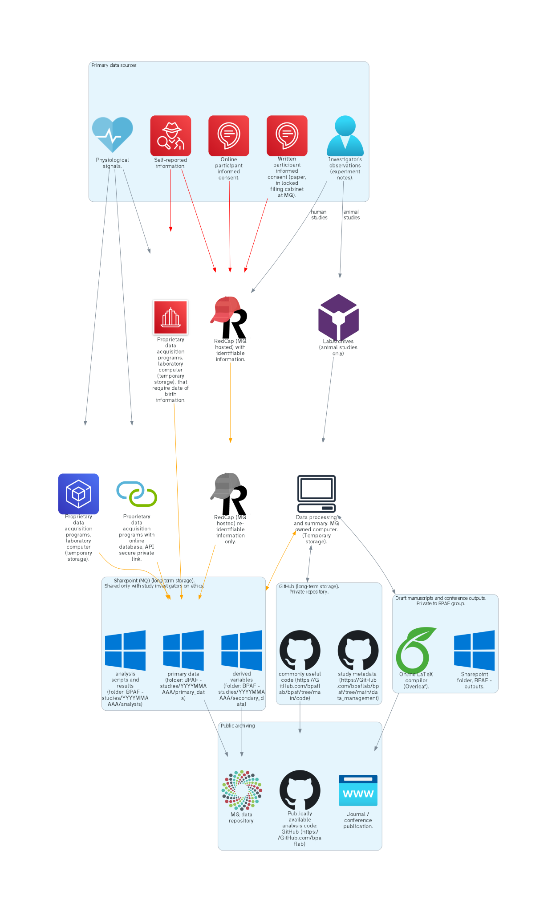

# Blood Pressure and Arterial Function (BPAF) Laboratory data management

**Version 5. 27th March 2023.**

This document outlines data management for the Blood Pressure and Arterial Function Laboratory, Macquarie Medical School, Faculty of Medicine, Health and Human Sciences, Macquarie University.

**Table of contents**
- [Blood Pressure and Arterial Function (BPAF) Laboratory data management](#blood-pressure-and-arterial-function-bpaf-laboratory-data-management)
  - [Operational data](#operational-data)
  - [Study data](#study-data)
    - [Data custodianship and access](#data-custodianship-and-access)
    - [Data sensitivity](#data-sensitivity)
      - [Removal of directly identiable information](#removal-of-directly-identiable-information)
    - [Study data flow mapping](#study-data-flow-mapping)
    - [Study data locations](#study-data-locations)
    - [Storage formats](#storage-formats)
    - [Proprietary storage formats](#proprietary-storage-formats)
  - [Meta-data](#meta-data)
    - [Variables](#variables)
      - [Demographics](#demographics)
      - [Waveform data](#waveform-data)
      - [Calculated values](#calculated-values)
  - [Document version history](#document-version-history)


## Operational data

| Item                | Location            | Version control | Staff access | Student access | Industry partner access |
|---------------------|---------------------|-----------------|--------------|----------------|-------------|
| Data management plan (master, this file) | Github (private to BPAF): [bpaflab/bpaf/tree/main/data_management](https://github.com/bpaflab/bpaf/tree/main/data_management) | git | push/pull | read only. Write via push request. | Copy available on request. |
|Data management plan (individual projects) | [Infonetica](https://fora-form.mq.edu.au/) | Infonetica | read/write   | read/write     | Copy available if listed on ethics |
| Ethics               | [Infonetica](https://fora-form.mq.edu.au/) (upload attachments in Infonetica as Microsoft Word documents to allow editing for any amendments) | Infonetica | read/write   | read/write     | Copy available if listed on ethics |
| Reference management | Zotero shared libraries: |  |                |             |
|                      | &nbsp;&nbsp;&nbsp;&nbsp;&nbsp;**[BPAF drafts](https://www.zotero.org/groups/4881073/bpaf_drafts)**. Planned, or in draft theses, manuscripts, conferences abstracts, conference papers. The reference in Zotero should include a link to where the draft files are located. Drafts should be either in Sharepoint ([Macquarie University\BPAF - outputs - outputs](https://mqoutlook.sharepoint.com/:f:/r/sites/o365-group-vascularresearch-outputs/Shared%20Documents/outputs?csf=1&web=1&e=0WOURQ)) or shared with the BPAF Laboratory members through [Overleaf](https://www.overleaf.com/login). | Not available. Deleted content moved to bin, where it can be retrieved. | read/write   | read/write     | none |
|                      | &nbsp;&nbsp;&nbsp;&nbsp;&nbsp;**[BPAF grant applications](https://www.zotero.org/groups/4881241/bpaf_grant_applications)** | As above. | read/write | none        | none |
|                      | &nbsp;&nbsp;&nbsp;&nbsp;&nbsp;**[BPAF publications](https://www.zotero.org/groups/2450744/bpaf_publications)** Published works from the group. Includes chapters, journal publications, conference talks (slides), and conference posters. Copies of the final version should reside in this Zotero library. | As above. | read/write | read only | read only |
|                      | &nbsp;&nbsp;&nbsp;&nbsp;&nbsp;**[BPAF resources](https://www.zotero.org/groups/2911966/bpaf_resources)** Available textbooks, manuals etc. that are held by the laboratory group. | As above. | read/write | read only   | none |
|                      | **University web profile**. Via [Pure](https://research-management.mq.edu.au/admin/workspace.xhtml). List of each group member's publications. | Not available. | read/write own profile    | read/write own profile | none |
| Safety | Github (private to BPAF): [bpaflab/bpaf/tree/main/safety](https://github.com/bpaflab/bpaf/tree/main/safety/) | git | push/pull | read only. Write via push request. | Copy available for those working in / visiting the lab |
| Software and code - inhouse   | GitHub (private to BPAF): [bpaflab/bpaf/tree/main/code](https://github.com/bpaflab/bpaf/tree/main/code) | git | push/pull | read only. Write via push request. | Copy available on request. |
| Purchased software             | Sharepoint: [Macquarie University\BPAF - general\software](https://mqoutlook.sharepoint.com/:f:/r/sites/o365-group-vascularresearch/Shared%20Documents/General/software?csf=1&web=1&e=niRGaz) | Historical software version should be named in folder structure. | read/write | read only |  none |
| Templates (posters, presentations, theses etc.)  | GitHub (private to BPAF): [bpaflab/bpaf/tree/main/templates](https://github.com/bpaflab/bpaf/tree/main/templates) | git | push/pull | read only. Write via push request. | Copy available on request. |

## Study data

### Data custodianship and access

The primary data custodian should be the Blood Pressure and Arterial Function Laboratory staff member leading the project.  If the project is lead by people external to the Blood Pressure and Arterial Function Laboratory and any data from that project is to be used or stored by the group, the group lead of the Blood Pressure and Arterial Function Laboratory will be the data custodian.

Data generated by staff or Higher Degree Researchers is owned by Macquarie University (alongside the Intellectual Property created during the collection or use of the Data), as per the [IP Policy](https://policies.mq.edu.au/document/view.php?id=207) and subject to any third party agreement.

### Data sensitivity

Most human studies conducted by the Blood Pressure and Arterial Function Laboratory include a participant general health survey. This means that all human studies contain health data and include *highly sensitive* data.

To minimise risk of accidental or deliberate disclosure of information, measures have been taken to ensure that security is placed around any location where directly identifiable information can be linked to health data. Directly identifiable information will only be entered into the following locations:

1. *RedCap*. Storing of participant information and consent forms, and questionnaire data. The data that should be *exported* from RedCap should exclude all directly identifiable information (name, date of birth). The RedCap database has been set up such that students cannot see or export directly identifiable information.
2. Paper copies of participant information and consent forms are digitised by scanning, and the physical copy securely destroyed. Digitised copies of participant information and consent forms should be uploaded to RedCap.
3. *Proprietary software requiring date of birth entry*. Some locally installed (laboratory computer) proprietary software for data acquisition requires date of birth for calculation of age (age cannot be entered directly). This is the only identifying information that should be entered into proprietary software. Participant names or initials should **not** be used. Instead, participants should be identified using a unique identifier code. When exporting data for analysis and long term storage, date of birth should be stripped from the data and replaced by age. Date of birth *should not be entered* in proprietary on-line (API linked) software. Where date of birth is required by such software, use a dummy date of birth unrelated to the participant.

#### Removal of directly identiable information

Participant data files and questionnaire data should be saved with a unique participant identifier (e.g. AAAA001). Participant identifiers should *not* contain name, initials, or date of birth information. The only linkage between the participant identifier and directly identifiable information will be in RedCap. That linkage data will only be accessible to staff members. The linkage data should only be required should there be an incidental finding related to a participant's health that the participant should be alerted to.

Any data made public must either:
1. Be presented in grouped form (no individual results), or
2. Have the re-identiable participant identifiers removed and replaced (randomly) with unique identifiers not associated in any way with the directly identifiable information.

See the figure below for data pathway coloured red indicating the flow of directly identifiable information.

### Study data flow mapping

The following diagram provides the direction of travel of data, and the general location of storage. Refer to the tables within this document for details on storage location, and file types used for storage. The diagram follows data from its place of acquisition (primary data sources), through to within-group long term storage, and public archiving of data.

<span style="color:red">**Red icons and lines**</span> indicate locations and passing of data that has directly identifiable information. <span style="color:orange">**Orange lines**</span> indicate data flows that contain potentially re-identifiable information (with access to RedCap identifiable information).



### Study data locations

Student and staff access to study data is limited to the data that they are listed as investigators for in the relevant ethics application and is managed at the folder level in Sharepoint ([Macquarie University\BPAF - studies](https://mqoutlook.sharepoint.com/:f:/r/sites/o365-group-vascularresearch-studies/Shared%20Documents/studies?csf=1&web=1&e=ZyZSLc)\YYYYMMAAAA) and by permissions rules in [RedCap](https://redcap.mq.edu.au/) limiting access through the variable `research_study'. The exception to this is study metadata (access to all members of the group) and open access data (access to the public).

| Item                                         | Location            | Version control | Staff access | Student access | Industry partner access |
|----------------------------------------------|---------------------|-----------------|--------------|----------------|---------------|
| Study metadata files                         | [Github meta data folder](https://github.com/bpaflab/bpaf/tree/main/data%20management/metadata) (private to BPAF). See meta-data section below for format details.  | git | read/write  | read only / write via staff. | Individual metadata files sent on request. |
| Participant Information and Consent (paper)  | Scanned and paper copies securely destroyed. Scanned copies uploaded to [RedCap](https://redcap.mq.edu.au/). | Logged by RedCap ("logging" menu).  | read/write | Conduct consent for single record (current study participant). No other access. | none |
| Participant Information and Consent (online) | [RedCap](https://redcap.mq.edu.au/). | Logged by RedCap ("logging" menu). Version control to the form itself [by field branching logic](https://vimeo.com/388228675). | read/write         | Write single record (current study participant). No other access. | none |
| Participant questionnaires                   | [RedCap](https://redcap.mq.edu.au/). | Logged by RedCap ("logging" menu). Version control to the form itself [by field branching logic](https://vimeo.com/388228675). | read/write         | read only. No access to identifying (name, date of birth) information. |  As per student access, if specified in ethics. |
| Laboratory notebook | Human studies: Notes field in [RedCap](https://redcap.mq.edu.au/).<br>Animal studies: Shared (with study investigators) LabArchives Electronic Laboratory Notebook | Native to online software | read/write | read/write | none |
| Primary source data (e.g., cardiovascular waveforms, oscillometric brachial blood pressure values by automated device)                    | Sharepoint (1): [Macquarie University\BPAF - studies](https://mqoutlook.sharepoint.com/:f:/r/sites/o365-group-vascularresearch-studies/Shared%20Documents/studies?csf=1&web=1&e=ZyZSLc)\YYYYMMAAAA\data_primary\ . See Variables section below for preferred nomenclature for variable names.<br>**Accepted data storage formats: see formats below.** | Primary data generally should be saved once from the source, and then never amended. If changes are required, version file naming (..._V1, ..._V2) should be used. | read/write   | Currently read/write (2) | As per student access, if specified in ethics. Collaboration with CardieX CONNEQT through Sharepoint folder [Macquarie University\CardieX CONNEQT at BPAF\general](https://mqoutlook.sharepoint.com/:f:/r/sites/BPVFCardieXConneQtLab/Shared%20Documents/General?csf=1&web=1&e=E754LW)\YYYYMMAAAA\data_primary\ | 
| Seconday data (e.g. calculated parameters from primary source data) |Sharepoint (1): [Macquarie University\BPAF - studies](https://mqoutlook.sharepoint.com/:f:/r/sites/o365-group-vascularresearch-studies/Shared%20Documents/studies?csf=1&web=1&e=ZyZSLc)\YYYYMMAAAA\data_secondary\ <br>**Accepted data storage formats: see formats below.** Best format will often be .csv.  | Version file naming (..._V1, ..._V2) should be used. | read/write | read/write |  As per student access, if specified in ethics. Collaboration with CardieX CONNEQT through Sharepoint folder [Macquarie University\CardieX CONNEQT at BPAF\general](https://mqoutlook.sharepoint.com/:f:/r/sites/BPVFCardieXConneQtLab/Shared%20Documents/General?csf=1&web=1&e=E754LW)\YYYYMMAAAA\data_secondary\ | 
| Analysis of data (e.g. statistical summaries) | Sharepoint (1): [Macquarie University\BPAF - studies](https://mqoutlook.sharepoint.com/:f:/r/sites/o365-group-vascularresearch-studies/Shared%20Documents/studies?csf=1&web=1&e=ZyZSLc)\YYYYMMAAAA\analysis\ <br>**Preferred analysis programs are Jamovi, Microsoft Excel, and Python.** | Version file naming (..._V1, ..._V2) should be used. | read/write | read/write | As per student access, if specified in ethics. Collaboration with CardieX CONNEQT through Sharepoint folder [Macquarie University\CardieX CONNEQT at BPAF\general](https://mqoutlook.sharepoint.com/:f:/r/sites/BPVFCardieXConneQtLab/Shared%20Documents/General?csf=1&web=1&e=E754LW)\YYYYMMAAAA\analysis\ | 
| Open access data (where specified in ethics application) | [Macquarie University Research Data Repository](https://figshare.mq.edu.au/data). Data should be licensed CC-BY International 4.0, requiring citation. | | read/write | read only / write via staff | read only |

(1) To ensure security in Sharepoint, access must be with the multi-factor authentication (MFA) authenticator app, not SMS. 

(2) Investigating options for write only access to prevent accidental deleting of data.

### Storage formats

| data type                  | format            | comments    |
|----------------------------|-------------------|-------------|
| Time sequence data.        | [European Data Format + (EDF+)](https://www.edfplus.info)   | Open format for "format for exchange and storage of multichannel biological and physical signals". |
| Time sequence data; tables | [Comma Separated values (CSV)](https://en.wikipedia.org/wiki/Comma-separated_values) | Make sure to use interprettable column headings, preferably using variable names as defined in this document . Prefer MS-DOS style (RFC4180 standard) CSV file.|
| Code                       | [Python](https://www.python.org) file types (.py, .ipynb) | Python is the preferred coding language. Shared code in R or MatLab also permitted if the circumstance requires that format. |

### Proprietary storage formats

Proprietary data formats are required for some data acquisition programs. These data will require backup in open format if containing data for long term storage.

| Proprietary program     | long-term storage format                     | comments    |
|-------------------------|-----------------------------------|-------------|
| ADInstruments LabChart  | [European Data Format + (EDF+)](https://www.edfplus.info)  | Use File→Save as... in LabChart. Whilst working on the project you may wish to use ADInstruments own file format as it preserves calculations, windows, options etc.  |
| AtCor SphygmoCor        | [Comma Separated values (CSV)](https://en.wikipedia.org/wiki/Comma-separated_values) for waveform variables. [European Data Format + (EDF+)](https://www.edfplus.info) or [Comma Separated values (CSV)](https://en.wikipedia.org/wiki/Comma-separated_values) for waveform data.   | No open format available that is entirely compatible with the software (export / import). |
| AtCor SphygmoCor XCEL   | [Comma Separated values (CSV)](https://en.wikipedia.org/wiki/Comma-separated_values) for waveform variables. [European Data Format + (EDF+)](https://www.edfplus.info) or [Comma Separated values (CSV)](https://en.wikipedia.org/wiki/Comma-separated_values) for waveform data.   | No open format available that is entirely compatible with the software (export / import). Interim backup should be in the AtCor XCEL ".bak" file format (Microsoft SQL sub-type format). | 
| BPLab                   | [Comma Separated values (CSV)](https://en.wikipedia.org/wiki/Comma-separated_values) | (3) |
| CED Spike               | [European Data Format + (EDF+)](https://www.edfplus.info)  |  |
| IEM Mobil-o-graph       | [Comma Separated values (CSV)](https://en.wikipedia.org/wiki/Comma-separated_values) | (3) |
| Impedimed Bioimpedance Spectoscopy (SOZO) | [Comma Separated values (CSV)](https://en.wikipedia.org/wiki/Comma-separated_values) |  |
| Finapres / Finometer    | [European Data Format + (EDF+)](https://www.edfplus.info)  | Finometer files can be converted to EDF+ using [EDFbrowser](https://www.teuniz.net/edfbrowser/).
| Somnomedics             | [Comma Separated values (CSV)](https://en.wikipedia.org/wiki/Comma-separated_values) | (3) |

(3) Ambulatory blood pressure data currently exported in CSV format. The medium term plan is to devise scripts to store this data in [European Data Format + (EDF+)](https://www.edfplus.info), possibly with use of [EDFbrowser](https://www.teuniz.net/edfbrowser/) .

## Meta-data

- Format: JSON
- See template: [000000TPLT.json](https://github.com/bpaflab/bpaf/blob/main/data%20management/metadata/000000TPLT.json)
- Example:

``` json
{
    "study_title": "Descriptive study title",
    "study_id": "YYYYMMAAAA",
    "study_location": "Where the study was physically conducted.",
    "study_start_date": "YYYYMMDD",
    "study_end_date": "YYYYMMDD",
    "study_description": "One sentence description of the study.",
    "principal_investigator": [
        "Principle Investigator Name",
        "Can List Multiple"
    ],
    "personnel": [
        "List Of",
        "Study Investigators"
    ],
    "data_sets": [
        {
            "data_set_name": "data set 1 name",
            "description": "primary data set",
            "location": "sharepoint/location",
            "format": "csv or labchart or etc",
            "data_starts_on_line": "2",
            "data_fields": [
                {
                    "field": "time",
                    "description": "time of measurement",
                    "type": "integer / float / string",
                    "units": "s",
                    "device": "LabChart"
                },
                {
                    "field": "electrocardiogram",
                    "description": "Lead II ECG",
                    "type": "integer / float / string",
                    "units": "mV",
                    "device": "ADInstruments Bioamplifier"
                }
            ]
        },
        {
            "data_set_name": "data set 2 name",
            "description": "Variables derived from data set 1 name.",
            "location": "sharepoint/location",
            "format": "csv or labchart or etc",
            "data_starts_on_line": "2",
            "data_fields": [
                {
                    "field": "time",
                    "description": "time of variable",
                    "type": "integer / float / string",
                    "units": "s",
                    "device": "calculated"
                },
                {
                    "field": "RR_interval",
                    "description": "RR interval from electrocardiogram.",
                    "type": "integer / float / string",
                    "units": "s",
                    "device": "calculated"
                }
            ]
        }
    ],
    "id_list": [
        "AAAA001", "AAAA002", "AAAA003", "AAAA004"
    ]
}
```

### Variables

Variables can be in any order, but should use the following naming convention across all forms of data storage. Variables for waveform should be of the form: *measurementsite_method*. Establishing these variables at their primary recording source (e.g., ADInstruments LabChart file template) is recommended.

#### Demographics

If a BPAF Laboratory data set, demographics should be captured and regained in RedCap.

| variable name   | variable format               | notes             |
|-----------------|-------------------------------|-------------------|
| study_id        | string                        | format YYYYMMAAAA (starting year, starting month, 4 letter abbreviation of study.) |
| subject_id      | string                        |
| age_yrs         | float (or integer)            |
| height_m        | float                         |
| weight_kg       | integer                       |
| bmi_kgpm2       | float                         |
| sex             | string                        |
| female          | TRUE / FALSE                  |
| gender          | string                        |
| study_date      | date time                     |
| study_time      | date time                     |
| on_antihypertensives  | TRUE / FALSE            |
| pregnant        | TRUE / FALSE                  |

Additional parameters to be added to variable list in future version of this document: stsandardised variables for demographic questionnaire as captured in RedCap.

#### Waveform data

| variable name                           | variable format               | notes   |
|-----------------------------------------|-------------------------------|---------|
| subject_id                              | string                        |         |
| maneuvre                                | string                        | Variable options: valsalva, leg_cuff_deflation, cycling, head_up_tilt, active_stand. |
| brachial_cuff_volumetric_discplacement  | float                         |         |
| radial_tonometry                        | float                         |         |
| finger_ppg_red                          | float                         |         |
| finger_ppg_infrared                     | float                         |         |
| finger_ppg_green                        | float                         |         |
| finger_ppg_blue                         | float                         |         |
| aortic_invasive_pressure                | float                         |         |

#### Calculated values

| variable name         | variable format               | notes     |
|-----------------------|-------------------------------|-----------|
| subject_id            | string                        |           |
| time_s                | date time or seconds          |           |
| hr_bpm                | float                         |heart rate (beats/min)          |
| asbp_mmHg             | float                         | aortic systolic blood pressure (mmHg)    |
| amap_mmHg             | float                         | aortic mean arterial pressure (mmHg)    |
| adbp_mmHg             | float                         | aortic diastolic blood pressure (mmHg)    |
| sbp_mmHg              | float                         | brachial systolic blood pressure (mmHg)  |
| map_mmHg              | float                         | brachial mean arterial pressure (mmHg)  |
| dbp_mmHg              | float                         | brachial diastolic blood pressure (mmHg)  |
| fsbp_mmHg             | float                         | finger systolic blood pressure (mmHg)    |
| fmap_mmHg             | float                         | finger mean arterial pressure (mmHg)    |
| fdbp_mmHg             | float                         | finger diastolic blood pressure (mmHg)    |
| cfpwv_mps             | float                         | carotid-femoral pulse wave velocity (m/s)          |
| aAIx_pct              | float                         | aortic augmentation index (%)    |
| bAIx_pct              | float                         | brachial augmentation index (%)  |
| rAIx_pct              | float                         | radial augmentation index (%)    |
| sevr                  | float                         | subendcardial viability ratio (Buckberg index) |
| sv_l                  | float                         | stroke  volume (l) |
| tpr_pru               | float                         | total peripheral resistance (peripheral resistance units = mmHg⋅min⋅mL<sup>-1</sup>) |
| respiratory_rate_bpm  | float                         | respirate rate (breaths/min)          |
| tidal_volume_l        | float                         | tidal volume (l)          |

Additional parameters to be added to variable list in future version of this document: VO2 testing parameters; COMPASS metrics; orthostatic grading scale.

## Document version history

| version | date       | authors                  | comments                                                                                 |
|---------|------------|--------------------------|------------------------------------------------------------------------------------------|
| 1       | 17/02/2023 | Mark Butlin              | First data management plan, with details on operational data, study data, and meta-data. |
| 2       | 01/03/2023 | Mark Butlin              | Acting on feedback from data management personnel at Macquarie University, added details for how version control should be conducted. Added github repository use for some operational data and metadata. |
| 3       | 08/03/2023 | Mark Butlin in consultation with Isabella Tan. | The previous system had study data spread between several Microsoft Teams study area "streams". This was problematic as people had access to the whole "stream", which included past data that ethically they should not be able to access. This version updates the folder structure and sharing so that individual studies only are shared with individuals, not an entire Teams space. |
| 4       | 09/03/2023 | Mark Butlin              | Responding to University review of data management plan. (1) [Information on re-identifiability of data added](#removal-of-directly-identiable-information) and [diagram](#study-data-flow-mapping) updated to colour-code (orange) potentially re-identifiable data flows. (2) Added [information on how re-identifiable information must be removed](#removal-of-directly-identiable-information) before making any data or data summary public. |
| 5       | 27/03/2023 | Mark Butlin              | Added distinction between master data management plan for the research group (this file) and individual project data management plans as required by the University. Added information on laboratory notebooks. |