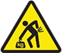

# Safe Work Instruction: Safe working in the Blood Pressure and Arterial Function (BPAF) Laboratory - Human related studies

**Laboratory location:** Testing Room 8, Suite 203, Level 2, 2 Technology Place, Macquarie University

**Document version:** 3.1

**Date:** 24th Feburary 2022

**Contact:** Mark Butlin

**Table of contents**
- [Safe Work Instruction: Safe working in the Blood Pressure and Arterial Function (BPAF) Laboratory - Human related studies](#safe-work-instruction-safe-working-in-the-blood-pressure-and-arterial-function-bpaf-laboratory---human-related-studies)
  - [Hazards](#hazards)
    - [Hazards for investigators](#hazards-for-investigators)
    - [Hazards for participants](#hazards-for-participants)
    - [Hazards for both investigators and participants](#hazards-for-both-investigators-and-participants)
  - [Personal proective equipment required](#personal-proective-equipment-required)
  - [Training required for inependent work](#training-required-for-inependent-work)
  - [Training required to work under *continual* supervision of trained personnel](#training-required-to-work-under-continual-supervision-of-trained-personnel)
  - [Immunisation](#immunisation)
  - [Notes on specific procedures](#notes-on-specific-procedures)
    - [Before starting any experiment or measurements:](#before-starting-any-experiment-or-measurements)
    - [After any experiment or measures](#after-any-experiment-or-measures)
    - [Ultrasonography](#ultrasonography)
    - [Maneuvers altering blood pressure](#maneuvers-altering-blood-pressure)
    - [Microneurography](#microneurography)
    - [Work involving children](#work-involving-children)
  - [Emergency procedures](#emergency-procedures)
    - [Emergency contacts](#emergency-contacts)
    - [Location of first aid equipment](#location-of-first-aid-equipment)
    - [Severe cardiovascular events (e.g., stroke, heart attack)](#severe-cardiovascular-events-eg-stroke-heart-attack)
    - [Participant experiences chest pain](#participant-experiences-chest-pain)
    - [Participant faints, feels light-headed or dizzy, and/or pale, cool, clammy to touch](#participant-faints-feels-light-headed-or-dizzy-andor-pale-cool-clammy-to-touch)
    - [Violent participant](#violent-participant)
  - [Reporting incidents](#reporting-incidents)
  - [Scheduled maintenance](#scheduled-maintenance)
  - [Other related procedures and supporting documents](#other-related-procedures-and-supporting-documents)
  - [Consultation](#consultation)
    - [Historical notes](#historical-notes)

## Hazards

### Hazards for investigators

**investigator:** Macquarie University staff or student, or visiting personnel, who are involved in conducting a study.

|      |                                            |
|------|--------------------------------------------|
|      | Be aware of **biohazards**. Double contained equipment that may have come into contact with blood may be temporarily stored in the laboratory before transport to PC2 environment. |
|      | Be aware that there may be an **increased risk of contracting vaccine-preventable diseases**. |
|  | Be aware of **manual handling risks** in moving benchtop equipment to set up studies. Be aware of risk of **muscle strain / repetitive strain injury** due to sustained periods in a posture to take measurements or enter data. Be aware of **musculoskeletal injury risk** if a participant faints, and you should need to assist them. |
|  | Be aware of possibility of **needlestick injury** from microneurography needles. |
|  | Be aware of the presence of **flammable materials**, including ethanol. |
|  | Be aware of presence of **toxic materials**, including disinfectants. |
|  | Be aware of possibility of **physical injury** from potentially violent study participants. |

### Hazards for participants

**participant:** Study participant or patient attending the Blood Pressure and Vascular Function Laboratory.

|      |                                             |
|------|----------------------------------------------------------------------------------------|
|  | **Fainting or feeling unwell** due to transient cardiovascular changes and challenges. |
|  | **Cardiovascular event** such as stroke or heart attack.                               |
|  | **Misdiagnosis** of participants through inaccurate measurement.                       |
|  | **Infection** from microneurography needles.                                           |

### Hazards for both investigators and participants

|      |                                             |
|------|-----------------------------------------------------------------------------------------|
|  | **Methicillin-resistant staphylococcus aureus (MRSA)** infection.                       |
|  | **Electric shock or electrocution** by faulty equipment.

## Personal proective equipment required
|      |                                             |
|------|-----------------------------------------------------------------------------------------|
|  | **Gloves** when handling disinfectants or potentially biohazardous material.            |

## Training required for inependent work
| Delivery          | Training | Training location |
|-------------------|----------|-------------------|
| Read              | This document (SWI-002 Safe working in the Blood Pressure and Arterial Function (BPAF) Laboratory) | - |
| On-line module    | MQ Health and Safety Induction (renewal every 2 years) | For students: [iLearn](https://ilearn.mq.edu.au/course/view.php?id=55543) For staff: [WorkDay](https://mq.okta.com/app/workday/exk9ip3npsNzgMgOl2p7/sso/saml) |
| On-line module    | Hazardous chemicals | For students: [iLearn](https://ilearn.mq.edu.au/course/view.php?id=55543) For staff: [WorkDay](https://mq.okta.com/app/workday/exk9ip3npsNzgMgOl2p7/sso/saml) |
| On-line module    | Privacy in practice (renewal every 2 years) | For students: ? For staff: [WorkDay](https://mq.okta.com/app/workday/exk9ip3npsNzgMgOl2p7/sso/saml) |
| On-line module    | Biosafety Awareness | or students: [iLearn](https://ilearn.mq.edu.au/course/view.php?id=55543) For staff: [WorkDay](https://mq.okta.com/app/workday/exk9ip3npsNzgMgOl2p7/sso/saml) |
| On-line module    | Hand Hygiene Australia Medical Module (training to be renewed annually) | http://nhhi.southrock.com/  |
| Read              | Macquarie University Hospital Policy “Clinical Observations and Deteriorating Patient Policy” | [Appendix A](AppendixA_Clinical_Observations_and_Deteriorating_Patient_Policy.pdf)
| Read              | Macquarie University Hospital Policy “Chest Pain Management Policy” | [Appendix B](AppendixB_Chest_Pain_Management_Policy.pdf) |
| Read              | Macquarie University Hospital Safe Work Instruction (SWI WHS-P201) “Assisting a falling or fallen patient” | [Appendix C](AppendixC_Assisting_a_falling_or_fallen_patient.pdf) |
| Read / Course attendance | Read DRSABCD action plan. It is recommended that investigators should complete basic first aid and/or CPR training. | [Appendix D](AppendixD_drsabcd_action_plan.pdf) |
| Read              | Safety Data Sheet (SDS) for any material[s you may use. | [Appendix G](AppendixG_SDS_ethanol_80pct_vv.pdf), [H](AppendixH_SDS_Milton_Solution.pdf), [I](AppendixI_SDS_Ultrasound_gel_Othersonic.pdf) |
| On-job training   <td colspan=2> Microneurography should only be conducted by investigators who have had extensive (minimum supervised training with 10 participants) training under someone who themselves has had extensive training in the procedure. |

## Training required to work under *continual* supervision of trained personnel

| Delivery          | Training | Training location |
|-------------------|----------|-------------------|
| Read              | This document (SWI-002 Safe working in the Blood Pressure and Arterial Function (BPAF) Laboratory) | - |
| On-line module    | MQ Health and Safety Induction (renewal every 2 years) | For students: [iLearn](https://ilearn.mq.edu.au/course/view.php?id=55543) For staff: [WorkDay](https://mq.okta.com/app/workday/exk9ip3npsNzgMgOl2p7/sso/saml) |
| On-line module    | Privacy in practice (renewal every 2 years) | For students: ? For staff: [WorkDay](https://mq.okta.com/app/workday/exk9ip3npsNzgMgOl2p7/sso/saml) |
| On-line module    | Hand Hygiene Australia Medical Module (training to be renewed annually) | http://nhhi.southrock.com/  |

## Immunisation

Activities conducted in the Blood Pressure and Vascular Function Laboratory fall under the Macquarie University Immunisation Policy and Procedure. Immunisation, or proof of past immunisation is required as per the Policy. See the Procedure for actions to take before starting any work in the Blood Pressure and Arterial Function Laboratory.
[https://staff.mq.edu.au/work/strategy-planning-and-governance/university-policies-and-procedures/policies/immunisation](https://staff.mq.edu.au/work/strategy-planning-and-governance/university-policies-and-procedures/policies/immunisation)

## Notes on specific procedures

### Before starting any experiment or measurements:

1.	**Locate the SDS folder** and other documents/posters in the room that may be required in case of emergency.
2.	**Ensure the area around where the participant will be positioned is clear.**
3.	Perform a **visual check of electrical equipment cords** for fraying/damage before use. Check the review date on the sticker is within past 12 months. If an issue is noted, tag the item for inspection and not for use, and report for maintenance review via the property service request system: https://ofm.mq.edu.au/service_request.html 

### After any experiment or measures

1.	**Wipe down any surface that has come into contact with the participant’s skin with 80% vol/vol ethanol.** This includes the inner surface of blood pressure cuffs.
2.	**Use disinfectant to soak any apparatus that has conducted the participants breath.** Consult disinfectant instructions for effective use. Consult the disinfectant SDS and use gloves if skin contact may cause irritation.
3.	**Tidy room.** The Blood Pressure and Vascular Function Laboratory is visited by members of the public and should always be clean and tidy. **This is also a safety issue** as a clear working area is easier to navigate in case of emergency.

### Ultrasonography
- Always write the date of opening on the ultrasound gel bottle.
- Check opening date of the ultrasound gel bottle and discard if it has been opened for 1 month or more.

### Maneuvers altering blood pressure
- Before any maneuver that potentially lowers blood pressure (for example: tilt-test; Valsalva maneuver; release of cuff on lower limb after a period of inflation likely to cause an ischaemic response), **verbally check with the participant that they are feeling ok** and not at all faint or light-headed.
- **Do not start a maneuver that may drop blood pressure if the participant is feeling faint, dizzy, or light-headed.** In the case of cuffs being inflated on limbs and the participant feeling unwell, release the cuff pressure slowly over 2 to 3 minutes to avoid any sudden, acute drop in blood pressure.
- Consult “Participant faints, feels light-headed or dizzy” under “Emergency procedures” below in the case of participants fainting, feeling dizzy or light-headed, and/or pale, cool, or clammy to touch.

### Microneurography
- Microneurography **needles must be cleaned, heat sterilized and packed** (at Macquarie University Hospital) according to manufacturer’s instructions (see appendix E).
- Check the needle tip is not damaged or bent. Discard if it is.
- Care should be taken at all times when handling microneurography needles as **needlestick injury is a hazard**. This is especially important once the needle has come into contact with the participant as the needle could then carry material to the investigator if stuck with the needle.

### Work involving children
If an investigator is to be involved in a study where the participants are, or may be, children the investigator will be required to undergo a Working With Children Check and send a copy of the issued certificate to the HR enquiries officer. Details at: https://webcentral.mq.edu.au/human_resources/recruit_and_induct_new_staff/recruitment_toolkit/working_with_children_checks/

## Emergency procedures

### Emergency contacts
|                       |                                                                  |
|-----------------------|------------------------------------------------------------------|
| MQ Health security    |	x9999 or 9812 3403 or activate distress button underneath desk |
| Cardiac clinic staff  |	x2900 or 9812 2900 or walk to front desk                       |
| Laboratory supervisor – Mark Butlin |	x2748 or 0422 908 895                              |

### Location of first aid equipment
|                       |                                                                  |
|-----------------------|------------------------------------------------------------------|
| First aid box         | Held behind reception.                                           |
| Resuscitation trolley including defibrillator | In alcove outside Testing Room 5.  |
| Distress alarm        | Under desk  |

### Severe cardiovascular events (e.g., stroke, heart attack)

Follow the “Clinical Observations and Deteriorating Patient policy ([Appendix A](AppendixA_Clinical_Observations_and_Deteriorating_Patient_Policy.pdf)).
1.	Get help by
    - Notifying reception of the incident (x2900 or 9812 2900 or walk to front desk). Ask reception to alert health professional(s) in the clinic to assist.
    - Call out for help.
    - When help arrives, ask them to call MQ Health security (x9999 or 9812 3403) and relay that there is a Code Blue.
2.	Follow “Code Blue” instructions as per Appendix A.
3.	Report incident as soon as possible after the incident (See section “Reporting incidents” for details).

### Participant experiences chest pain

1.	Follow the Chest Pain Management Policy ([Appendix B](AppendixB_Chest_Pain_Management_Policy.pdf)).
2.	Get help by
    - Notifying reception of the incident (x2900 or 9812 2900 or walk to front desk).
    - Call out for help.
    - Activate Code Blue/Rapid response if clinical concerns or chest pain>10 minutes.
3.	Report incident as soon as possible after the incident (See section “Reporting incidents” for details).

### Participant faints, feels light-headed or dizzy, and/or pale, cool, clammy to touch

1.	Immediately support the participant to avoid them hitting their head as per MQ Health Safe Work Instruction Assisting a falling or fallen patient ([Appendix C](AppendixC_Assisting_a_falling_or_fallen_patient.pdf)). 
2.	If the participant is on the tilt-table, move the table to a horizontal position. If the participant is seated:
    - follow above MQ Health Safe Work Instruction Assisting a falling or fallen patient.
    - immediately and rapidly remove any recording equipment which may hinder moving the participant to a supine position.
3.	Raise the participant’s legs (either pillows under straightened legs or knees up with feet on the ground).
4.	Notify reception assistance is required (x2900 or 9812 2900 or walk to front desk).
5.	Note time of event and monitor blood pressure and heart rate.
6.	Keep participant in a supine position for a minimum of 10 minutes, or longer, until participant is feeling well and ready to slowly sit up again.
7.	Report incident as soon as possible after the incident (See section “Reporting incidents” for details).

### Violent participant
1.	Remove yourself from the danger (leave the room, find the company of other people in the clinic). If you cannot leave the laboratory, activate the distress button underneath the desk – this directly links to Hospital security.
2.	Contact MQ Health security (x9999 or 9812 3403) and relay the nature of the threat.
3.	Report the incident as soon as possible after the incident (See section “Reporting incidents” for details).

Suggestions on how to manage aggressive behaviours are provided in [Appendix F](AppendixF_Fact_Sheet_Managing_Aggressive_Behaviour.pdf) “Tips on how to manage aggressive behaviours”.

## Reporting incidents

- Report the incident to your supervisor, the practice manager and online at the link below. 
- Submit a report via the Macquarie University online reporting form: https://staff.mq.edu.au/support/other-resources/online-systems/roar as soon as possible and within 24 hours.
- If the event occurred in a study covered by a human ethics application at Macquarie University, submit a report via the Human Research Ethics Management system: https://www.mq.edu.au/research/ethics-integrity-and-policies/ethics/human-ethics/post-approval as soon as possible and within 48 hours.
- If the incident involves an MQ Health patient, the practice manager or their delegate will lodge a Riskman report for the MQ Health patient safety and quality team to review.

## Scheduled maintenance
- Electrical equipment safety testing and tagging should be conducted annually as part of the MQ Health facilities management preventative maintenance schedule.
- Calibration of blood pressure measurement devices should be conducted annually by biomedical engineering contractors as part of the MQ Health facilities management preventative maintenance schedule.

## Other related procedures and supporting documents

| Appendix | Title |
|----------|-------|
| A	| Macquarie University Hospital Policy “Clinical Observations and Deteriorating Patient Policy”
| B	| Chest Pain Management Policy
| C | Macquarie University Hospital Safe Work Instruction (SWI) Number WHS-P201 “Assisting a falling or fallen patient”
| D | DRSABCD action plan (St John Ambulance Australia). Also on display in room. https://www.stjohnnsw.com.au/drsabcd-action-plan/
| E | [Cleaning and Sterilization of Microelectrodes](AppendixE_research_electrode_cleaning_sterilization.pdf) |
| F | Fact Sheet – Tips on how to manage aggressive behaviour https://wiki.mq.edu.au/display/healthandsafety/Fact+Sheet+Managing+Aggressive+Behaviour
| G | SDS ethanol 80% v/v. Also in SDS folder in room.
| H | SDS Milton antibacterial solution. Also in SDS folder in room.
| I | SDS ultrasound gel. Also in SDS folder in room.
| - | Macquarie University Immunisation Policy and Procedure. Policy Central (A to Z page) https://staff.mq.edu.au/work/strategy-planning-and-governance/university-policies-and-procedures/policies/immunisation
| - | Macquarie University Working With Children Checks https://webcentral.mq.edu.au/human_resources/recruit_and_induct_new_staff/recruitment_toolkit/working_with_children_checks/
| - |	Matsuo M, Oie S, Furukawa H. Contamination of blood pressure cuffs by methicillin-resistant Staphylococcusaureus and preventive measures. Ir J Med Sci. 2013 Dec;182(4):707-9. doi: [10.1007/s11845-013-0961-7](https://doi.org/10.1007/s11845-013-0961-7) |

## Consultation

| Name / Position                                         | Date           |
|---------------------------------------------------------|----------------|
| Mark Butlin (Senior Lecturer)                           | 17th July 2020 |
| Isabella Tan (Research Associate)                       | 20th July 2020 |
| Karen Peebles (Senior Lecturer)                         | 20th July 2020 |
| Tina McDonald (Health and Safety - Risk Assurance Team) | 13th June 2019 |

**Approved by:** Mark Butlin

**Date of implementation:** 8th February 2021

**Review date [5 years]:** 8th February 2026 2026 or review following any incident, accident or near-miss, or the system has been identified as not effective; if adopted by a new work group; if the equipment is relocated, updated or replaced, or if there has been an industry product safety alert involving all or part of the process components.

### Historical notes
| Version and Date | Author Name/Position | Reason for review |
|------------------|----------------------|-------------------|
| Version 3.1; 24th February 2022 | Mark Butlin (Senior Lecturer) | •	Updating web links. |
| Version 3; 8th February 2021    | Mark Butlin (Senior Lecturer) | •	Refurbished physical space (smaller room, different layout). Updated policy and procedure documents. •	Updated severe cardiovascular event (e.g. stroke, heart attack) to be consistent with updated policy and procedure documents. •	Added chest pain section to be consistent with updated policy and procedure documents. •	Added section for training of personnel acting under continual supervision. |
| Version 2; 21st June 2019       |	Mark Butlin (Senior Lecturer) |	•	Incident – study participant fainted. •	Lab moved to new location. •	Document overdue for review. |
| Version 1; 14th August 2012     |	Mark Butlin (Research Associate) | Titled “Non invasive blood pressure, cardiovascular pulse detection, and  electrocardiogram measurement in humans” |
